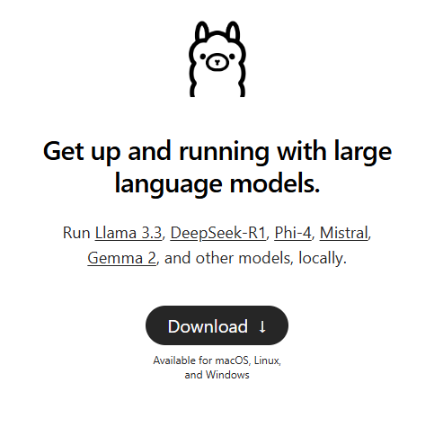
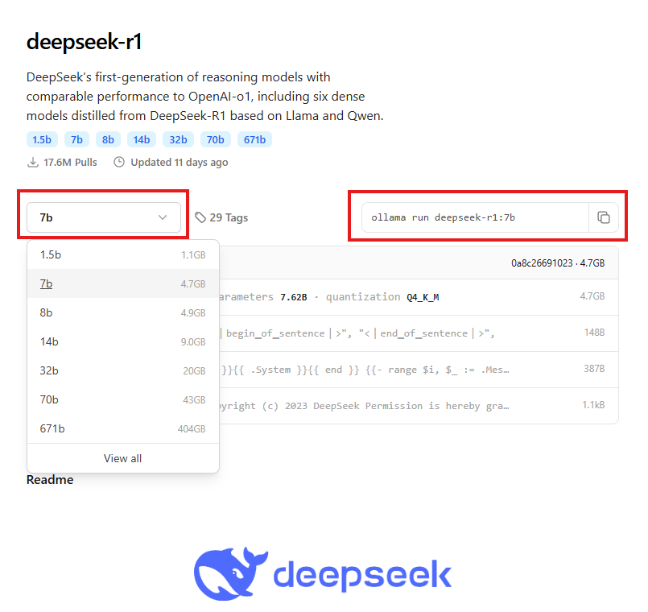
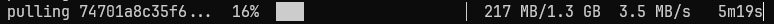
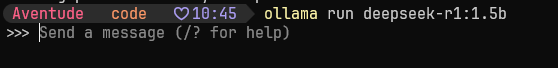
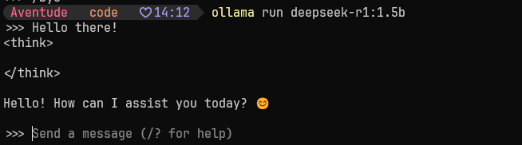
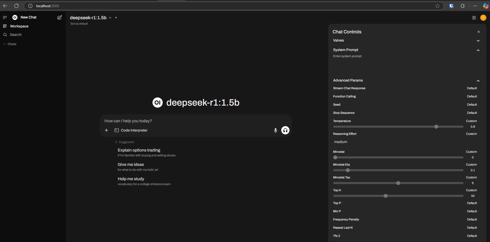

# Installing Ollama
## Installation

### Download the installer
Visit Ollama's official website and download the Windows/Mac installer.

### Run the installer

Open the .exe file and follow the setup instructions.
### Verify installation

Open Command Prompt (cmd) or PowerShell and run:

`ollama --version`

If installed correctly, it should display the installed version.

## Pulling a model
Go to https://ollama.com/search and search for a model, you can find many famous models here. 

1. Select the model size
2. Copy the command from right hand side text box.

3. Paste the command in the Terminal
It may take a while to download the model depending on the size,

4. Now you can start writing prompts against the model

## Ollama Terminal vs. Web UI – Why Use the Open Web UI?
Ollama is powerful, but using it in the terminal has some limitations:

- No History – Conversations reset every time you restart.
- Limited Formatting – No rich text, images, or structured responses.
- Hard to Manage Long Interactions – Scrolling through long outputs in the terminal isn’t ideal.
- Less User-Friendly – Running models via CLI requires manual commands.

### Set up Open Web UI for a Better Experience!
- Chat history & better response formatting 📝
- Easier multi-turn conversations 💬
- More interactive & visually structured 🖥️
- No need to type commands each time!

