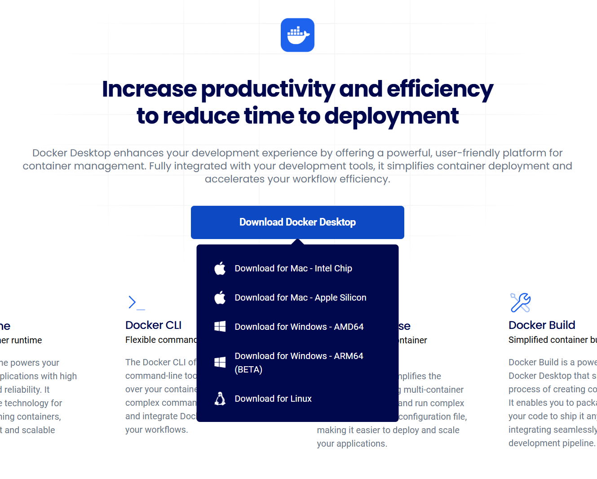
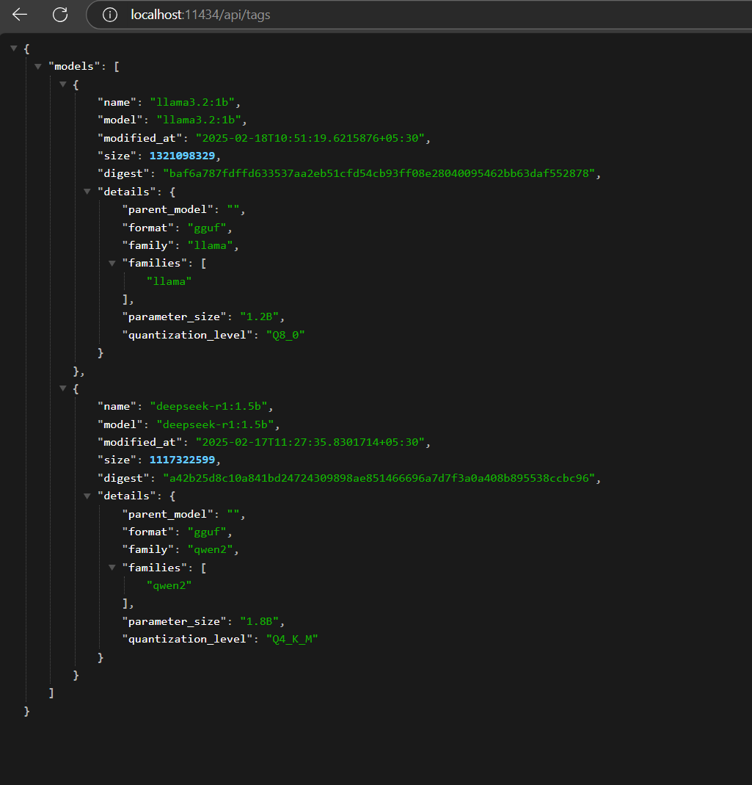
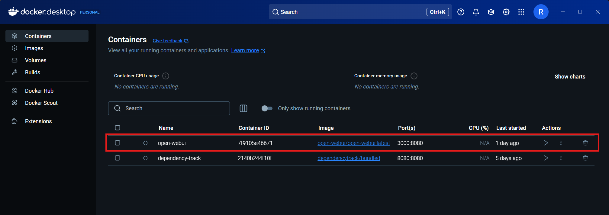
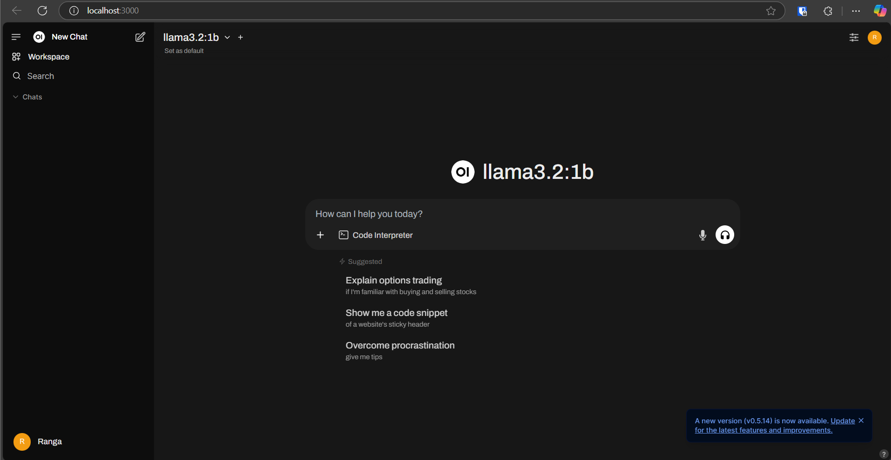

# Run Open Web UI in Docker

## Download and install docker | Configure

1. Open Docker Desktop and make sure it’s running without errors.

2. Run a model with ollama command
    ` ollama run deepseek-r1:1.5b`

3. Check whether you can access either of below URLs
   
    - http://localhost:11434/api/tags
    - http://host.docker.internal:11434/api/tags

    You should see something like below, Depending on the models you already pulled.

    

4. pull open-web-ui 
- `docker pull ghcr.io/open-webui/open-webui:latest`

5. Create and run a container
- `docker run -d -p 3000:8080 -e OLLAMA_BASE_URL=http://host.docker.internal:11434 -v open-webui:/app/backend/data --name open-webui ghcr.io/open-webui/open-webui:latest`

This will create a volume and continer for open web ui from the image you pulled in the previous request.

Start the container if not running | Under the actions there is a play button. Give it some time or till this appears on the logs of the container.

Now you can navigate to [`http://localhost:3000/`](http://localhost:3000/) and start play around. 

We'll check what Open-WebUI has to offer in a upcoming post.

